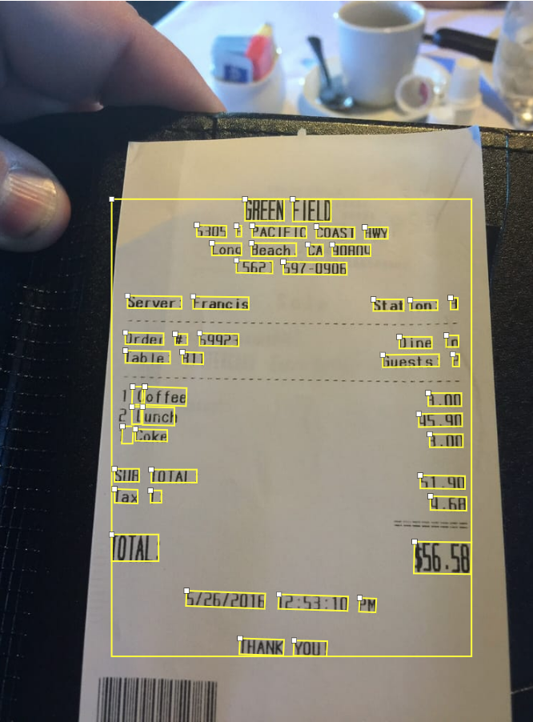
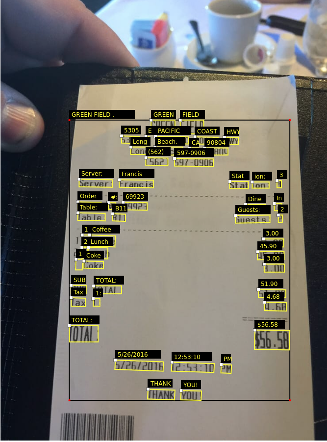

# Rename upload

Rename all the file from a folder and upload it to AWS S3 bucket.

## Quick run
1. `pip3 install -r requirements.txt`
2. config conf.json
3. `python3 rename_upload.py`

# Via converter

Import google vision annotation to [VGG Image Annotator](https://www.robots.ox.ac.uk/~vgg/software/via/)
.

| :exclamation:   All image in folder image (or other define image folder) are imported. Be careful to the number of request !   |
|-----------------------------------------|

## Quick run

1. `pip3 install -r requirements.txt`
2. Set up [google cloud vision](https://cloud.google.com/vision/docs/quickstart-client-libraries)
3. `python3 main.py` to change the image folder path you can specified it in argument of `via_json` function.
4. Go to [VGG Image Annotator 3](https://www.robots.ox.ac.uk/~vgg/software/via/app/via_image_annotator.html), **open a
   VIA project** and choose output.json. (If image file aren't find, download the HTML file)

## Result

|    |            |   |
|----------|:-------------:|------:|
