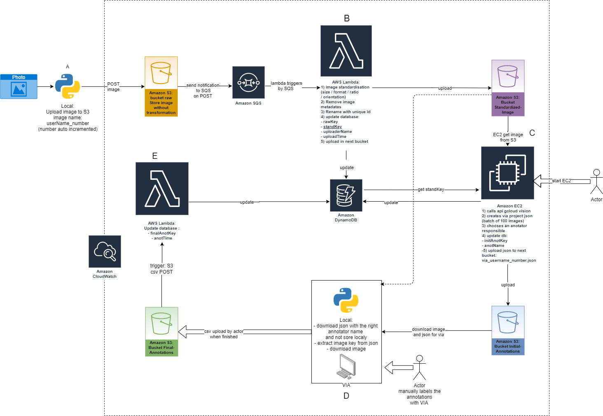
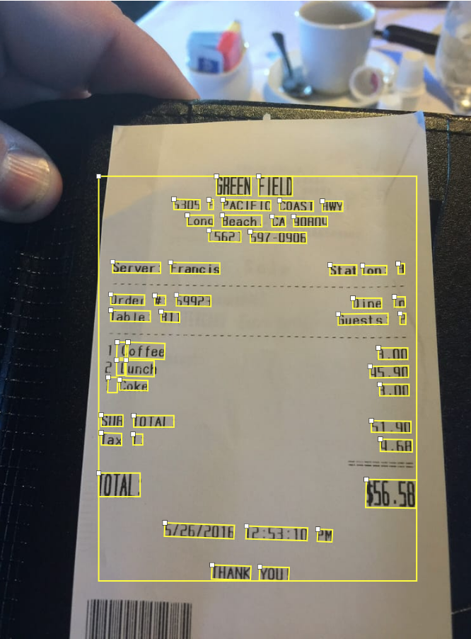
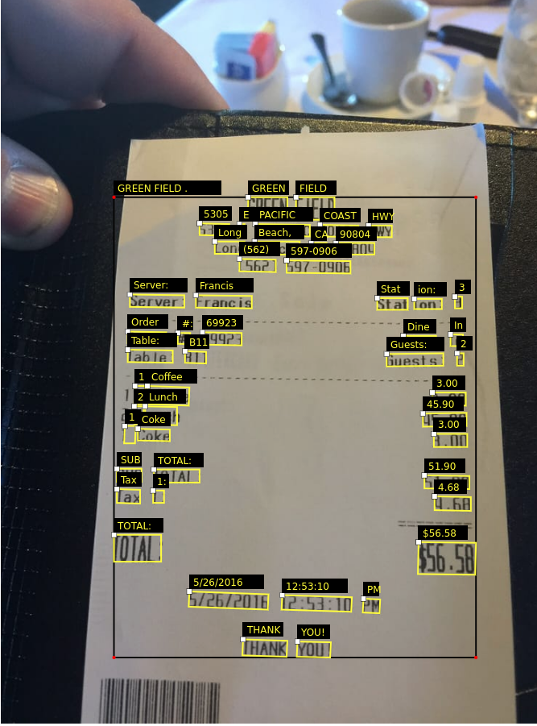

# AWS structure



# Configuration

Before use edit conf.json. You need to edit:

1. `user`: your username.
2. `bucket_raw`: bucket where raw image are upload
3. `bucket_standardized`: bucket where standardized image are upload
4. `bucket_initial_annotation`: bucket where initial json annotation are uploaded
5. `dynamoDB`: region and table name

If the part that you will use don't need one of this parameter you can ignore it.

# A) Rename upload

Rename all the file from a folder and upload it to AWS S3 bucket.

## Quick run

1. `pip3 install -r requirements.txt`
2. config conf.json
3. `python3 rename_upload.py`

# C) Via converter

Import google vision annotation to [VGG Image Annotator](https://www.robots.ox.ac.uk/~vgg/software/via/)
.

| :exclamation:   All image in folder image (or other define image folder) are imported. Be careful to the number of request !   |
|-----------------------------------------|

## Quick run

1. `pip3 install -r requirements.txt`
2. Set up [google cloud vision](https://cloud.google.com/vision/docs/quickstart-client-libraries)
3. `python3 ec2.py` to used conversion locally without EC2 you can use  `via_json_local` function (
   tools/via/via_converter.py).
   User data for EC2 (compatible Debian and Ubuntu):
   ```
   #!/bin/bash
   sudo apt update
   sudo apt install python3-pip -y
   cd home/$USER
   git clone https://github.com/assansanogo/Opteeq.git
   cd Opteeq
   pip3 install -r requirements.txt
   ```

4. Go to [VGG Image Annotator 2](https://www.robots.ox.ac.uk/~vgg/software/via/via.html), **open a VIA project** and
   choose output.json. (If image file aren't find, download the HTML file, project settings change default path)

## Result

|    |            |   |
|----------|:-------------:|------:|

# D) Download json and image

Download all image and json for a given annotator name.

## Quick run

1. `pip3 install -r requirements.txt`
2. config conf.json
3. `python3 download.py`
